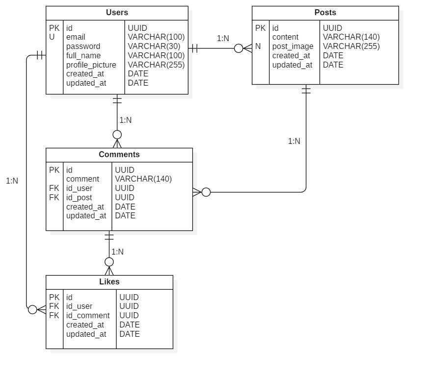
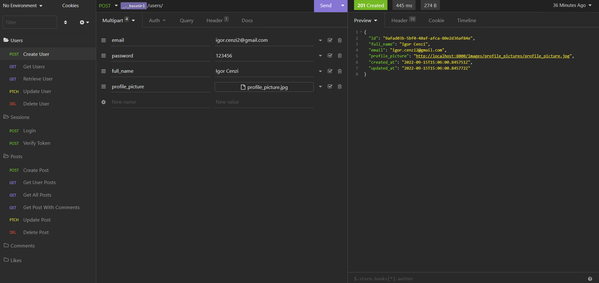

# Seleção Singolar - Back-End Django

API Rest para gerenciamento de Publicações, com possibilidade de comentários e “likes” em comentários, com controle de usuários e login utilizando JWT. Utilizando banco de dados Postgres em Docker para armazenar dados e salvando imagens em pastas locais.

### Tecnologias Utilizadas

- Python/Django
- Rest Framework
- Swagger
- Redoc
- Django Simple JWT
- Docker
- Postgres
- DotEnv

### Diagrama Entidade Relacionamento - DER



## Rodando o projeto na sua máquina

Primeiramente, você precisa ter o Docker e o Git instalados em sua máquina e configurado.

Com o Git instalado e configurado, você pode clonar este repositório utilizando o comando no terminal:

```bash
git clone git@github.com:igorcenzi/selecao-singolar.git
```

Depois de clonar, você precisa criar um arquivo de configuração. Na raiz do projeto crie um arquivo chamado .env
Dentro do arquivo .env.example, copie as variáveis e cole no arquivo criado e preencha com suas informações. Ele está sendo mapeado tanto no aplicativo django quanto no docker, então você não irá precisar alterar nada mais.

Agora, entre na pasta do projeto e execute este comando no terminal:

```bash
docker compose up
ou
docker-compose up
```

Caso esteja no linux e apareça algum erro de permissão, é só executar os comandos acima com a palavra sudo antes do comando.

### Acessando a documentação

Neste projeto temos dois tipos de documentação: Swagger e Redoc.

Com o projeto executando, em seu navegador insira a url: [localhost:8000/docs/api](http://localhost:8000/docs/api) para acessar a documentação do Swagger ou [localhost:8000/docs/redoc](http://localhost:8000/docs/redoc) para a documentação Redoc.

Em ambas as documentações tem todos os endpoints do projeto explicando o que cada rota recebe e responde.

### Rotas

Na documentação tem a lista de todas as rotas, mas para facilitar para você eu coloquei no projeto um arquivo json chamado insomnia_singolar que você pode importar no seu Insomnia. Neste arquivo já tem todas as rotas automatizadas e documentadas, com exemplos de requisições que você pode usar para testes ou alterar os parâmetros e usar dados diferentes.


